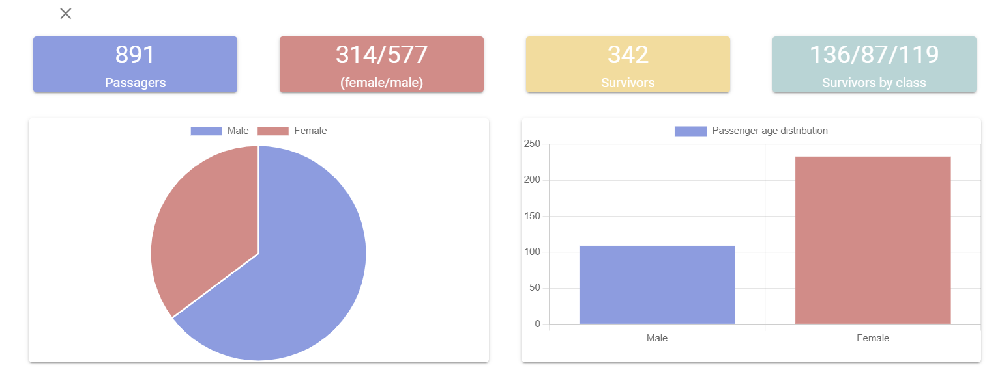

# Titanic

# backend

```bash

## execute in cd/titanic

# Install symfony and PHP

https://symfony.com/doc/current/setup.html

# execute

$ composer install

$ yarn install

# doctrine database

php bin/console doctrine:database:create

php bin/console doctrine:migrations:migrate

php bin/console load_titanic_data

$ symfony serve:start


```

# frontend

```bash

## execute in cd/frontend

# install dependencies
$ yarn install

# serve with hot reload at localhost:3000
$ yarn dev

```

# Main page image

<div align="center">
    
</div>

# Data page image

<div align="center">
    
</div>
